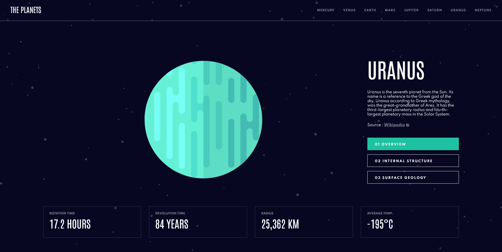

This is a solution to the [Planets fact site challenge on Frontend Mentor](https://www.frontendmentor.io/challenges/planets-fact-site-gazqN8w_f).

## Table of contents

- [Overview](#overview)
  - [The challenge](#the-challenge)
  - [Screenshot](#screenshot)
  - [Links](#links)
- [My process](#my-process)
  - [Built with](#built-with)
  - [What I learned](#what-i-learned)

## Overview

### The challenge

Users should be able to:

- View the optimal layout for the app depending on their device's screen size
- See hover states for all interactive elements on the page
- View each planet page and toggle between "Overview", "Internal Structure", and "Surface Geology"

### Screenshot

### Links

- [Solution URL](https://github.com/humbruno/planets-fact)
- [Live Site URL](https://planets.brunosantos.dev/)

## My process

### Built with

- Semantic HTML5 markup
- SCSS
- Flexbox
- Desktop-first workflow
- [React](https://reactjs.org/) - JS library
- [React Icons](https://react-icons.github.io/react-icons/)
- [Vite](https://vitejs.dev/) - Development environment for React

### What I learned

What a ride! This was my first React project and while there are definitely things to polish up, I am VERY proud of the end-result! I'm also looking forward to revisiting this project in a few months to compare my skills evolution.

The initial proposal of this project was to have a different URL for each planet but I decide to take a different approach to open up scalability (not sure how! new planets would need to appear inside our solar system!)

Instead of hard-coding each page and its contents, I decided to use JSON data containing each planet's information and map through that file using JavaScript/React to render the contents according to the interface actions (navbar clicks, buttons).

I reached the end-result rather quickly but wasn't quite happy with it. I quickly noticed I didn't take advantage of one the biggest selling points of React - components!

Once I had the page fully functional, I started separating my code into different components. Looking back, this is something I should have planned before starting to write code, so that I wouldn't need to backtrack. Definitely a lesson learned for the future!

Can't wait to continue building more things with React, the possibilities are amazing!
